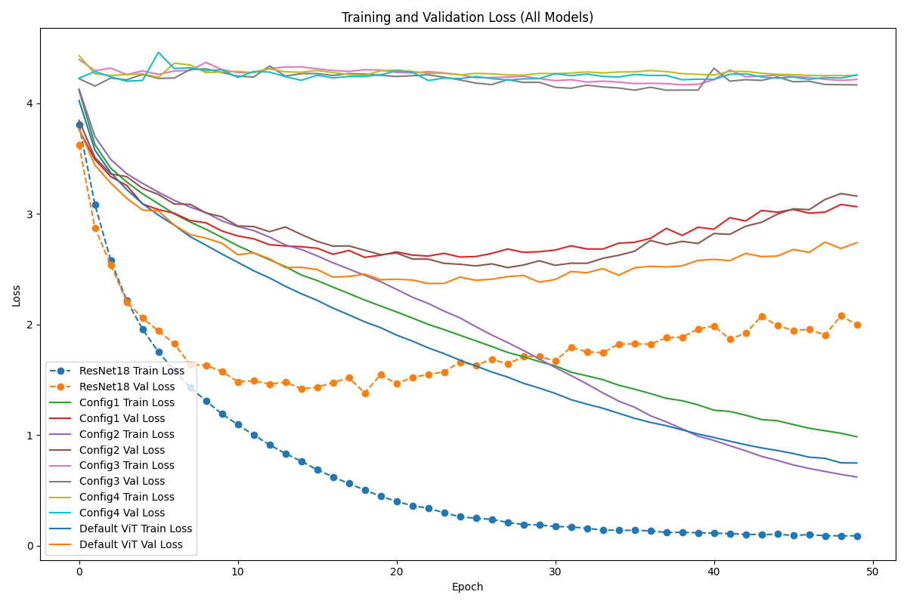
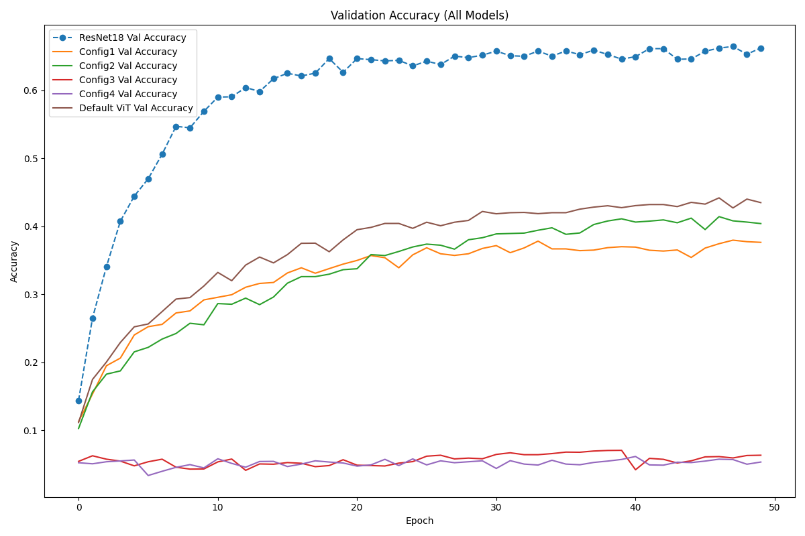
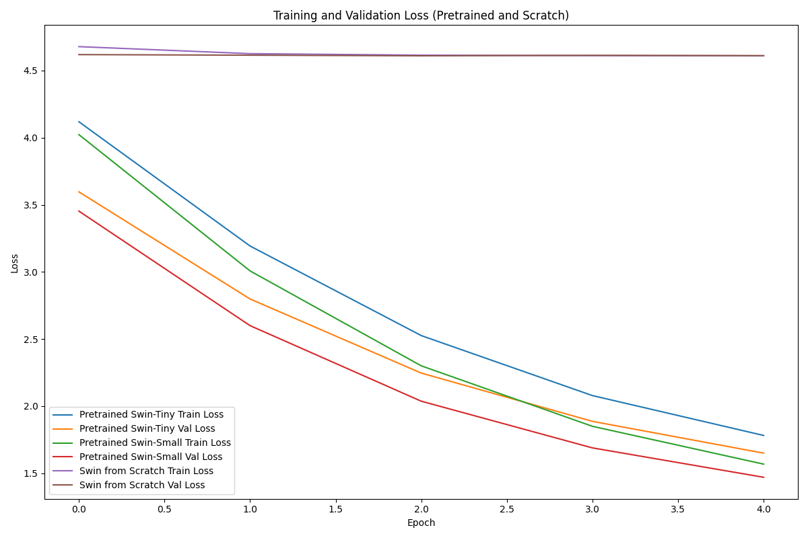
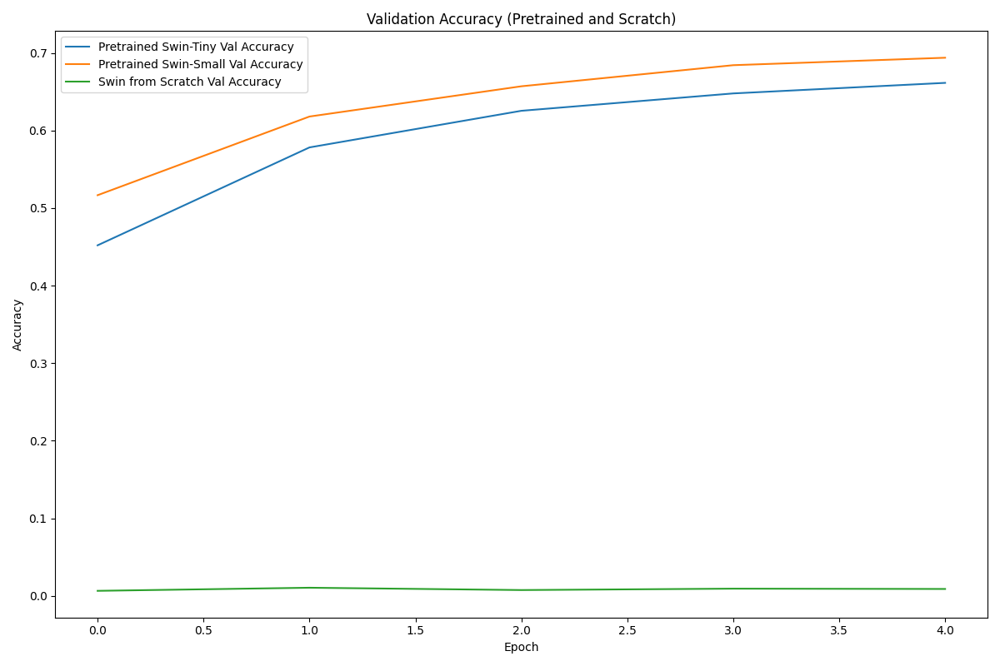

# ECGR-5106 Homework 6

## Student Information
**Name:** Yang Xu  
**Student ID:** 801443244  
**Homework Number:** 6  

## GitHub Repository
[https://github.com/xuy50/ecgr5106-hw6](https://github.com/xuy50/ecgr5106-hw6)

---

## Problem 1: Design and Analysis of Vision Transformers for CIFAR-100

### 1.1 Introduction
This problem focuses on designing a Vision Transformer (ViT) from scratch for the CIFAR-100 dataset, which comprises 100 classes of 32×32 RGB images. Different ViT configurations are experimented with by varying the patch size, embedding dimension, number of transformer layers, and number of attention heads. The objective is to evaluate the trade-offs between model complexity (i.e., parameter count and estimated FLOPs), training time, and performance (validation and test accuracy) compared to a ResNet‑18 baseline.

### 1.2 Implementation Details
- **Data Loading:**  
  The CIFAR-100 dataset is loaded using `torchvision.datasets.CIFAR100` with standard data augmentation (random crop, horizontal flip) and normalization. The dataset is split into training, validation, and test sets.

- **ResNet‑18 Baseline:**  
  A modified ResNet‑18 architecture is used as the baseline model. The final fully-connected layer is adjusted to output 100 classes.

- **Vision Transformer (ViT) Architecture:**  
  The custom ViT model is composed of the following components:
  - **Patch Embedding:** Divides the input 32×32 image into non-overlapping patches (configurations include 4×4 and 8×8).
  - **Transformer Encoder Blocks:** Stacked to form the main network. Configurations with 4 and 8 layers are examined.
  - **Classification Head:** A linear layer that maps the class token features to 100 classes.
  
  The following hyperparameters are varied:
  - **Patch Size:** 4×4 and 8×8  
  - **Embedding Dimension:** 256 and 512  
  - **Transformer Layers:** 4 and 8  
  - **Attention Heads:** 2 and 4  
  The MLP hidden dimension in each transformer block is set to four times the embedding dimension (e.g., 1024 for an embedding dimension of 256).

- **Training Setup:**  
  Both the ResNet‑18 baseline and ViT models are trained on CIFAR‑100 using similar hyperparameters:
  - **Batch Size:** 64 (or 128, as specified in parts of the code)
  - **Epochs:** 50  
  - **Optimizer:** Adam with a learning rate of 0.001  
  During training, model parameter counts, estimated FLOPs (using tools such as `torchinfo` or manual computation), training time per epoch, and test accuracy are recorded.

### 1.3 Experimental Results

#### ResNet‑18 Baseline:
- **Parameter Count:** 11,220,132  
- **Test Accuracy:** 65.86%

#### Default ViT:
- **Parameter Count:** 3,214,692  
- **Test Accuracy:** 45.89%

#### ViT Configurations Summary:
| Configuration | Patch Size | Embed Dim | Layers | Heads | # of Params | Final Val Acc | Avg Epoch Time (s) | Test Accuracy |
|---------------|------------|-----------|--------|-------|-------------|---------------|--------------------|---------------|
| **Config1**   | 4×4        | 256       | 4      | 4     | 3,214,692   | 37.64%        | 8.86               | 38.72%        |
| **Config2**   | 4×4        | 256       | 8      | 4     | 6,373,732   | 40.40%        | 16.90              | 42.72%        |
| **Config3**   | 8×8        | 512       | 4      | 2     | 12,769,892  | 6.34%         | 7.58               | 6.52%         |
| **Config4**   | 8×8        | 512       | 8      | 4     | 25,379,428  | 5.34%         | 14.48              | 4.73%         |

#### Figures:
- **Training and Validation Loss Curves:**  
  
- **Validation Accuracy Curves:**  
  

### 1.4 Analysis and Discussion
- **ResNet‑18 Performance:**  
  The ResNet‑18 baseline achieves a test accuracy of 65.86%, demonstrating the robustness of traditional CNN architectures on CIFAR‑100.
- **ViT Performance:**  
  The Default ViT, using the chosen configuration, underperforms relative to the ResNet‑18 baseline. Among the ViT configurations, models employing a smaller patch size (4×4) and lower embedding dimension (256) with 4 transformer layers and 4 attention heads (Config1 and Config2) yield better validation and test accuracies compared to larger models (Config3 and Config4). The latter, which employ an 8×8 patch size and an embedding dimension of 512, have a higher parameter count and longer training times but exhibit markedly lower accuracy, likely due to over-parameterization on the available dataset.
- **Trade-offs:**  
  Increasing the model capacity by adding layers and larger dimensions does not necessarily improve accuracy on a small-scale dataset like CIFAR‑100. More complex models require longer training times and incur higher computational costs, often yielding diminishing returns in performance.

### 1.5 Conclusions
ResNet‑18 achieves a test accuracy of 65.86%, confirming the effectiveness of traditional convolutional neural networks on CIFAR‑100. In contrast, the Default ViT, with a substantially lower parameter count, attains only 45.89% test accuracy. Among the various ViT configurations, those employing a 4×4 patch size and an embedding dimension of 256 with 4 transformer layers and 4 attention heads (Config1 and Config2) deliver comparatively better performance (with test accuracies of 38.72% and 42.72%, respectively) than configurations using an 8×8 patch size and 512 embedding dimension, which achieve test accuracies below 7%. These results indicate that, for CIFAR‑100, increased model capacity beyond a certain point leads to over-parameterization and decreased performance, along with increased training time and computational expense.

---

## Problem 2: Fine-tuning Pretrained Swin Transformer Models on CIFAR-100

### 2.1 Introduction
This problem examines the fine-tuning of pretrained Swin Transformer models from the Hugging Face Transformers library on the CIFAR‑100 dataset. The investigation compares the performance of the Tiny and Small variants against a Swin Transformer trained from scratch. Metrics such as training time per epoch, final validation accuracy, test accuracy, and model parameter counts are compared.

### 2.2 Implementation Details
- **Pretrained Models:**  
  Swin‑Tiny and Swin‑Small are loaded using `SwinForImageClassification.from_pretrained()`, with their classification heads adjusted to output 100 classes. The backbone is frozen, and only the classifier head is fine-tuned.
- **Swin from Scratch:**  
  A Swin Transformer is instantiated from a configuration derived from the Swin‑Tiny config, modified for CIFAR‑100 (with `num_labels=100`), and randomly initialized.
- **Training Setup:**  
  - **Epochs:** 5  
  - **Batch Size:** 32  
  - **Optimizers:**  
    - Pretrained models use Adam with a learning rate of 2e-5.  
    - The scratch model uses Adam with a learning rate of 0.001.  
  - **Preprocessing:**  
    Images are resized to 224×224 and normalized using the mean and standard deviation from the pretrained image processor.
- **Metrics Recorded:**  
  Training time per epoch, final validation accuracy, test accuracy, and parameter counts.

### 2.3 Experimental Results

#### Summary Table:
| Model                          | Training Method       | # of Params | Avg Epoch Time (s) | Final Val Acc | Test Accuracy |
|--------------------------------|-----------------------|-------------|--------------------|---------------|---------------|
| **Pretrained Swin‑Tiny**       | Fine-tuning           | 76,900      | 86.87              | 66.14%        | 65.60%        |
| **Pretrained Swin‑Small**      | Fine-tuning           | 76,900      | 143.70             | 69.38%        | 69.48%        |
| **Swin Transformer (Scratch)** | Training from scratch | 27,596,254  | 214.68             | 0.90%         | 1.00%         |

#### Figures:
- **Training and Validation Loss Curves:**  
  
- **Validation Accuracy Curves:**  
  

### 2.4 Analysis and Discussion
Fine-tuning the pretrained Swin‑Tiny and Swin‑Small models produces significantly higher accuracy than training the same architecture from scratch. The pretrained models attain test accuracies of 65.60% and 69.48%, respectively, while the model trained from scratch achieves only 1.00% test accuracy, despite a much larger parameter count. This disparity highlights the importance of leveraging pretrained feature representations when training data is limited. Additionally, although the Swin‑Small model requires a longer training time per epoch than Swin‑Tiny, it provides marginally higher accuracy, suggesting that the additional model capacity is advantageous under fine-tuning conditions.

### 2.5 Conclusions
The experiments demonstrate a clear advantage for fine-tuning pretrained Swin Transformer models over training from scratch. Pretrained Swin‑Tiny and Swin‑Small models achieve test accuracies of 65.60% and 69.48%, respectively, whereas the model trained from scratch reaches only 1.00%. This significant difference underscores the benefit of using pretrained weights to obtain robust feature representations from limited data. Although the Swin‑Small model incurs a longer training time per epoch compared to Swin‑Tiny, its slightly higher accuracy indicates that additional capacity can be beneficial when pretrained. Overall, these results emphasize that transfer learning is critical for achieving competitive performance on small-scale image classification tasks such as CIFAR‑100.

---

## General Conclusions
A trade-off exists among model complexity, computational cost, training time, and final accuracy. Traditional CNN architectures like ResNet‑18 continue to perform robustly on CIFAR‑100. Fine-tuning pretrained models—specifically, pretrained Swin Transformer variants—yields significantly better performance than training from scratch, even when the latter possesses a vastly higher parameter count. The experiments highlight that increased model capacity does not guarantee improved performance on limited datasets and that pretrained backbones offer a practical solution to reduce training time and enhance generalization. Future work could explore hybrid architectures or more sophisticated training schemes (e.g., adaptive learning rate schedules, advanced data augmentation, or ensembling) to further improve performance.